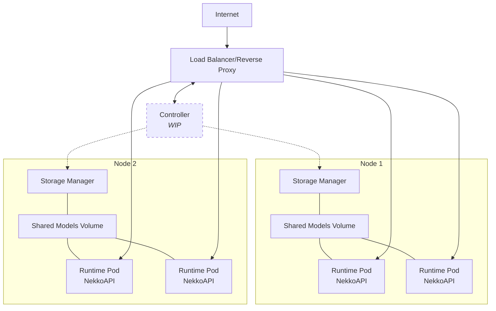

# Clowder is a distributed Ainekko engine

Clowder is a distributed generative AI engine for local inference at a cluster
scale. The goal is to have a ~~simple~~ easy to use API that hides
a lot of complexity and doesn't feel that much distinct from
common cloud offerings.

It's is composed of multiple pieces of Open Source software. The Clowder unifies and "packages" it
in a single place:
- inference runtime (actually with llama.cpp underneath - of course) https://github.com/aifoundry-org/NekkoAPI
- LLM aware load balancer
- cluster controller (WIP)
- storage manager (manages AI models) https://github.com/aifoundry-org/storage-manager
- (bonus) oxide controller that bootstraps Clowder cluster on [0xide](https://oxide.computer/) https://github.com/aifoundry-org/oxide-controller



[NOTE]: Clowder is very much in development and is not expected to be used in
production, but should be fit to play with it.

## 0xide

If you are a lucky one to have access to an [0xide computer](https://oxide.computer)
platform, you can deploy Clowder cluster here in a few ~~simple~~ steps.

1. Get `oxide-controller` tool binary. TODO: download or build.

2. Have your oxide project credentials ready. If you have Oxide CLI
[configured](https://docs.oxide.computer/guides/quickstart-cli), you don't need
to do anything else. Otherwise, you need:
- URL of your Oxide host.
- The existing oxide project name where you want to host Clowder.
- Oxide access token that has the rights to control chosen project.

3. (optional) You can deploy [tailscale](https://tailscale.com/) on the
cluster and avoid consuming external IPs completely (and numeral other benefits
provided by tailscale). For this you need:
- tailnet name (the one that looks like `something.ts.net`)
- tailscale auth [key](https://login.tailscale.com/admin/settings/keys). It must
  be configured as "reusable".
- tailscale API [key](https://login.tailscale.com/admin/settings/keys). This key
  will only be used once to find the first cluster node as it joins the tailnet.
- tailscale ACL [configured with the
  tag](https://tailscale.com/kb/1068/tags#define-a-tag) you intend to use for
  Clowder (defaults to `ainekko-k8s-node`).

4. Linux OS image that you intend to use for Oxide VM instances. So far
only debian-bullseye is tested. If the image is already available
in your oxide project (or silo) you just need to note its name. Otherwise
you can provide image URL.

Step 1.

Run this command (modify for your needs):

```sh
oxide-controller \
  --cluster-project clowder \ # The name of the existing oxide project
  --oxide-api-url "https://mycoolexidehost.com" \
  --control-plane-root-disk-size 16 \
  --control-plane-image-name debian-bullseye \
  #--control-plane-image-source "image url" # Upload image from this URL to the oxide project 
  --control-plane-external-ip=false \       # Can be enabled when using tailscale
  --worker-count 1 \  # Number of worker VMs
  --worker-cpu 2 \    # Number of vCPUs per worker VM
  --worker-memory 8 \ # Memory in GB on a worker CPU
  --worker-root-disk-size 16 \  # Size of the worker disk, stores docker images etc
  --worker-extra-disk-size 16 \ # Size of the disk used to store models
  --worker-image-name debian-bullseye \
  --tailscale-auth-key "file:ts-auth.key" \ # local file with tailscale auth key
  --tailscale-api-key "file:ts-api.key" \   # local file with tailscal API key
  --tailscale-tailnet tail66ef.ts.net \
  -v1 # Verbosity: make it explain itself
```

Run oxide controller. Wait. (There are many more command line options, run
`oxide-controller --help`)

After some time it creates oxide VMs and boostraps kubernetes cluster. Configuration
for the cluster is written to `~/.kube/oxide-controller-config`.
If you don't have other kubernetes clusters, you can move the configuration to default
place (will overwrite your existing configuration!):

```sh
mv ~/.kube/oxide-controller-config ~/.kube/config
```


## Deployment

Let's assume you already have kubernetes cluster up and running. It has some
control plane nodes and several "worker" nodes (any non-control-plane node is
considered worker node).


### With helm

The easiest way to install Clowder is using [helm](https://helm.sh/) package manager:

```sh
helm install clowder oci://docker.io/aifoundryorg/clowder
```


### With kubectl

Otherwise you can use kubernetes cli directly. For this to work you should clone
this repository first:

```sh
git clone https://github.com/aifoundry-org/clowder.git
cd clowder
```

Then deploy all the parts with a single command:

```sh
kubectl apply -f k8s/
```

You with Clowder using a single service, let's expose it to have it available
locally (if your kubernetes cluster has proper external IPs you may skip this
part):

```sh
# Start this and leave running in a separate terminal window.
kubectl port-forward svc/nekko-lb-svc 3090:3090
```

[TODO]: add part about controller once it's available.


## Usage

To do anything useful with generative AI first you need to get some models and deploy them to the
cluster.

[NOTE]: Once cluster controller is implemented, the interface to deploy and scale models will be
automatic and much simpler.

Let's get a list of physical nodes to decide on which node to deploy our model with runtime:

```sh
kubectl get nodes
# You will get something like this:
# NAME                                 STATUS   ROLES                       AGE   VERSION
# ainekko-control-plane-0-10ahb6ro     Ready    control-plane,etcd,master   85m   v1.32.4+k3s1
# ainekko-worker-1747986577-r7qql3ie   Ready    <none>                      85m   v1.32.4+k3s1
# ...
```

Please note the name of the worker node as we have to give it as parameter.
Let's use a small quantized model from the Hugging Face repository
[https://huggingface.co/unsloth/SmolLM2-135M-Instruct-GGUF](https://huggingface.co/unsloth/SmolLM2-135M-Instruct-GGUF).
We define it using special `hf` URL schema. Also, as we are downloading models fom Hugging Face, we need to provide valid
[access token](https://huggingface.co/docs/hub/security-tokens).

[TODO]: describe supported URL schemas.

```sh
curl -H "Authorization: Bearer nekko-admin-token" \ # hardcoded for now until proper auth is implemented as part of controller project
  -X POST \
  --data '{"modelUrl": "hf:///unsloth//SmolLM2-135M-Instruct-GGUF/SmolLM2-135M-Instruct-Q4_K_M.gguf", "modelAlias": "smol", "nodeName": "ainekko-worker-1747986577-r7qql3ie", "credentials": "YOUR_HUGGING_FACE_TOKEN"}' \
  -i \
  http://localhost:3090/api/v1/workers
```

This downloads the model and starts a worker runtime pod, let's check:

```sh
curl -H "Authorization: Bearer nekko-admin-token" http://localhost:3090/api/v1/workers/list
# {"count":1,"status":"success","workers":[{"name":"","model_name":"smol","model_alias":"smol"}]}
```

The two above calls we made were using operational API. The regular "end user" can
use OpenAI API compatible endpoint to do inference itself.

Let's get a list of available models:

```sh
curl http://localhost:3090/v1/models
```

We can now use `http://localhost:3090/v1/chat_completions` as we would any
OpenAI API compatible chat completions endpoint.

By default, Open WebUI client app is deployed on the cluster.

Expose it locally with:

```sh
# Start this and leave it running in a separate terminal window.
kubectl port-forward svc/open-webui 4080:4080
```

Now we can open the UI at [http://localhost:4080](http://localhost:4080), select the model
and have a chat.

Thanks!
